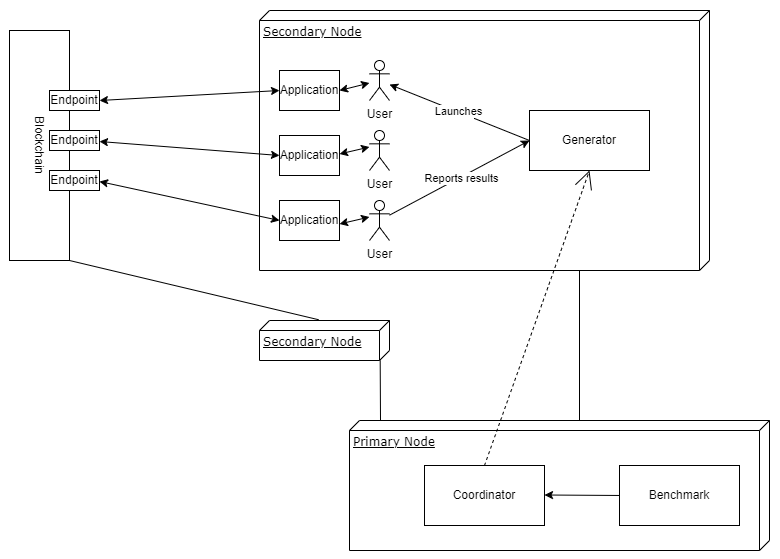

# Diablo: Distributed Analytical BLOckchain Benchmark Framework

Diablo, an analytical blockchain benchmark framework focusing on distributed clients.

## Applications

* Payment
* Store

## User behaviors

* Stubborn 

## Architecture



The communication between aspects is done via a TCP interface and an exchange of JSON encoded Packets.

### Main components

#### Benchmark

The benchmark defines the workload and the experiment steps. It implements the Benchmark interface. Currently, two types of benchmarks are implemented. The Simple benchmark and the Custom benchmark which is specified programmatically by the Diablo user.

#### Blockchain

Considered as a black box implementing the Blockchain interface. 

#### Users and Applications 

The workload consists in Users specific to the previously mentioned Applications. They interact with an Application which contains a Blockchain client that connects to a given Blockchain endpoint. 

### Primary

This is the main Diablo node, it orchestrates the benchmark to be run. It generates and distributes the workload to the secondaries, and sends commands to run and retrieve results from the benchmark.

### Secondary

The secondary clients are acting as clients interacting with the blockchain. Each secondary communicates with the primary to receive commands and run the related work. It controls a group of users.

## Getting Started

### Requirements

* Go `go version 1.22` or greater.

### Installation

1. Clone this repository
2. Run `go mod download` in this repository to install dependencies.
3. Build the benchmark using the `Makefile` or directly calling ``go build main/diablo.go``

### Running the Benchmark

1. Start the primary node to run a simple benchmark:
```sh
./diablo primary --secondaries <number-of-secondaries> --benchmark simple --duration <duration> --tps <rate> --blockchain blockchain-name --user user-type --accounts .config/accounts-file.yaml -o <output-file> -e <blockchain-endpoint> -e <blockchain-endpoint> -e <blockchain-endpoint> 
```
for example:
```sh
./diablo primary --secondaries 1 --benchmark simple --duration 120s --tps 400 --blockchain ethereum --user stubbornPaymentUser --accounts .config/400accounts.yaml -o output.json -e "ws://127.0.0.1:9000" -e "ws://127.0.0.1:9001" 
```

2. Start the secondaries on their respective machines:
```sh
./diablo secondary --primary <address:port>
```
for example:
```sh
./diablo secondary --primary "127.0.0.1:5000" 
```

## Reading Material (for development)

* Golang Ethereum Developer Book: https://github.com/miguelmota/ethereum-development-with-go-book
* Interacting with contracts via raw transaction creation: https://ethereum.stackexchange.com/questions/10486/raw-transaction-data-in-go
